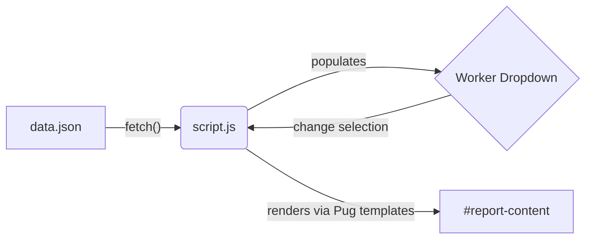

# WCB Forms — Assignment 2

A dynamic browser-based application that loads worker data from a backend JSON file and renders professional WCB reports using **compiled Pug templates**.


---

# Video Demo

**Google Drive Link**

Paste your demo video link here.

---

# Application Design: Two Forms, One Sheet

A major feature of this project is its **Single Page Application (SPA)** architecture.

Rather than creating separate HTML pages for different forms, **both the Medical & Travel Expense Request form and the Worker Progress Report are built into a single `index.html` page.**

### Features

- Dynamic toolbar for switching between forms
- Two different datasets for dynamic rendering
- Browser-based rendering using compiled Pug templates
- No page refresh required
- Single HTML page architecture
- Dynamic JavaScript rendering

---

# Form Previews

## Medical & Travel Expense Request


---

## Worker Progress Report


---

# Architecture & Data Flow

This project uses **Pug (formerly Jade)** to generate HTML templates cleanly and efficiently.



### Workflow

1. Worker data is loaded from `data.json`.
2. JavaScript fetches and processes the selected dataset.
3. The worker dropdown is populated dynamically.
4. Compiled Pug templates render the selected form.
5. Switching forms or datasets updates the page instantly without reloading.

---

# Technologies Used

- HTML5
- CSS3
- JavaScript (ES6)
- Pug Template Engine
- JSON

---

# Features

- Single Page Application (SPA)
- Compiled Pug Templates
- Dynamic Dataset Switching
- Reusable Pug Mixins
- Dynamic Form Rendering
- Responsive Layout
- PDF-like Design
- Automatic Page Numbering
- Dynamic Header & Footer
- Browser-based Rendering
- Clean Project Structure

---

# Project Structure

```
Assignment-2/
│
├── assets/
│   └── WCB_of_Manitoba_logo.png
│
├── docs/
│   └── samples/
│       ├── medical-expense-page1.png
│       ├── medical-expense-page2.png
│       ├── worker-progress-page1.png
│       ├── worker-progress-page2.png
│       └── worker-progress-page3.png
│
├── index.html
├── styles.css
├── script.js
├── pug-templates.js
├── worker.pug
├── medical.pug
├── renderWorker.js
├── renderMedical.js
├── data.json
└── README.md
```

---

# How to Run

1. Clone or download this repository.
2. Open `index.html` in any modern web browser.
3. Choose a form from the toolbar.
4. Select Dataset 1 or Dataset 2.
5. The selected report is rendered instantly using compiled Pug templates.

No installation or additional packages are required.

---

# Candidate Details

**Name:** Patan Nasreen

**GitHub:** https://github.com/npatan-netizen

---

# Thank You
